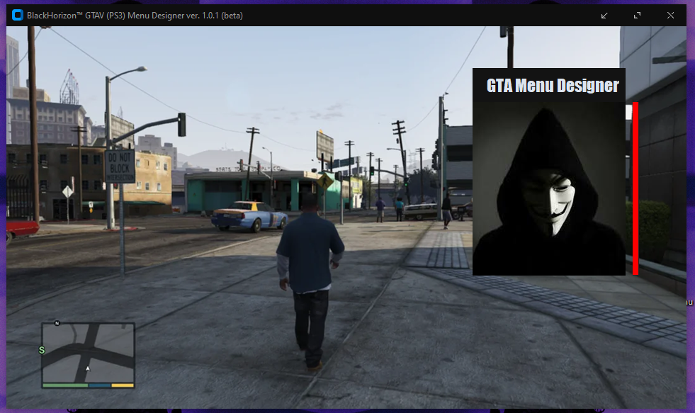

# GTA-V-Menu-Designer
Basicamente, é um programa de interface gráfica que auxilia na criação do design dos ModMenus do GTA V.

## Para que serve esta ferramenta?
Tool that simulates a graphical interface similar to that of GTA V (PS3). This tool serves to assist in creating ModMenus for GTA V.

## Informações basicas da ferramenta:

- Nome: BlackHorizon™ (GTA V Menu Designer)
- Versão: 1.0.1 (beta)
- Equipe: After Dawn Team (https://afterdawnteam.com)
- Developer: 27prxblms (Xzhyan)
- Linguagem: Python

---

## Utilização:

Certifique-se de ter os seguintes itens instalados.

- Python 3
- CustomTkinter (biblioteca Python)
- Pillow "PIL" (biblioteca Python)

### Exemplo simples de uso, mudar nome, cor e outros.
https://youtu.be/W7WyBE10zl4?si=sxiMU8pDOTA1_-rB

### Exemplo de uso para criar novos "DRAW_RECTs".
https://youtu.be/W7WyBE10zl4?si=sxiMU8pDOTA1_-rB

